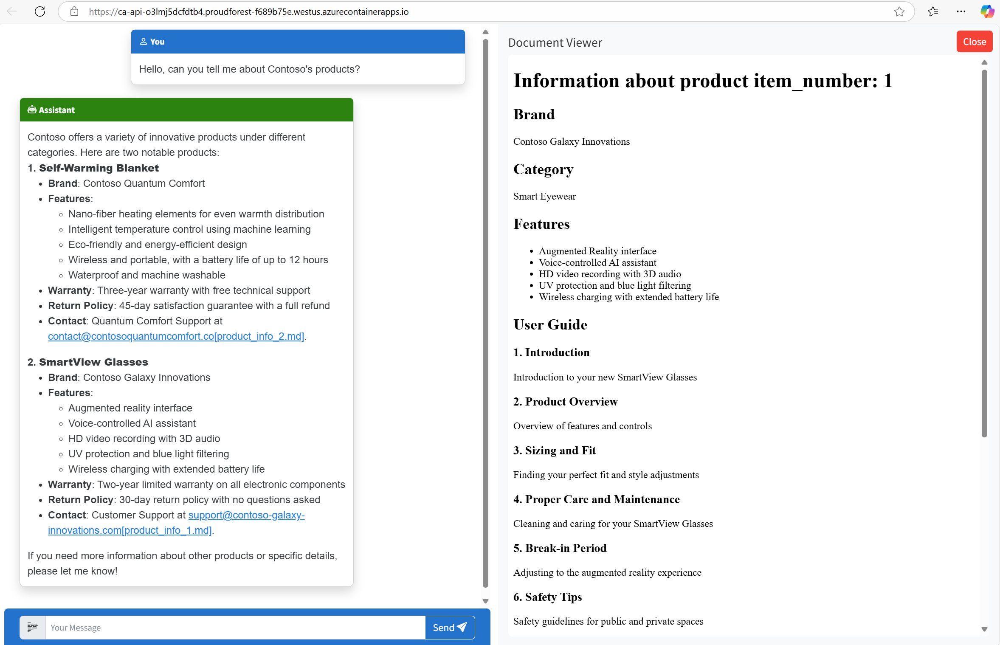

<!-- YAML front-matter schema: https://review.learn.microsoft.com/en-us/help/contribute/samples/process/onboarding?branch=main#supported-metadata-fields-for-readmemd -->
<!-- TODO: update this^ -->

# Azure AI Foundry Starter Template

This project creates an Azure AI Foundry hub, project and connected resources including Azure AI Services, AI Search and more. It deploys an agent chat application to Azure Container Apps that uses Azure File Search with uploaded files and can provide citations.



* [Getting started](#getting-started)
  * [Prerequisites](#prerequisites)
  * [Download the Project Code](#download-the-project-code)
  * [Configure your Project and Agent (optional)](#configure-your-project-and-agent-optional)
* [Deploying with azd](#deploying-with-azd)
* [Local Development Server](#local-development-server)
* [Guidance](#guidance)
    * [Troubleshooting](#troubleshooting)
        * [Provisioning and Deployment Failures](#provisioning-and-deployment-failures)
        * [Azure Container Apps](#azure-container-apps)
        * [Agents](#agents)
    * [Costs](#costs)
    * [Security guidelines](#security-guidelines)
    * [Azure Resources](#azure-resources)

<!-- TODO: rename repo azure-ai-agents-chat -->

## Running the Template

### Prerequisites 
1. Make sure the following tools are installed:

    * [Azure Developer CLI (azd)](https://aka.ms/install-azd)
    * [Python 3.9+](https://www.python.org/downloads/)
    * [Docker Desktop](https://www.docker.com/products/docker-desktop/)
    * [Git](https://git-scm.com/downloads)

2. Make sure you have an Azure account and an Azure Subscription. If you do not have an Azure account, follow these instructions: 
    
    1. Sign up for a [free Azure account](https://azure.microsoft.com/free/) and create an Azure Subscription
    
    2. Check that you have the necessary permissions:
        * Your Azure account must have `Microsoft.Authorization/roleAssignments/write` permissions, such as [Role Based Access Control Administrator](https://learn.microsoft.com/azure/role-based-access-control/built-in-roles#role-based-access-control-administrator-preview), [User Access Administrator](https://learn.microsoft.com/azure/role-based-access-control/built-in-roles#user-access-administrator), or [Owner](https://learn.microsoft.com/azure/role-based-access-control/built-in-roles#owner).
        * Your Azure account also needs `Microsoft.Resources/deployments/write` permissions on the subscription level.

### Download the Project Code 
<!-- TODO: update this when we have the final name and we know it will be published -->
1. Download the project code, using either azd or cloning the github repo.

    Using azd:
    ```shell
    azd init -t azure-ai-agents-chat
    ```
    Using github:
    ```shell
    git clone https://github.com/Azure-Samples/azure-ai-agents-chat.git
    ```
2. Open the project folder in your terminal or editor.

### Configure your Project and Agent (optional)

If you would like to use an existing AI project resource or change the default agent, follow the steps below. For more options on customizing the deployment to disable resources, change resource names, or customize the models, you can follow these steps in [deployment customizations](docs/deploy_customization.md) now.

#### Using an existing AI project resource
This step applies if you have an existing AI project resource, and you want to bring it into the solution. Locate the connection string on the overview page of your Azure AI project, then set the following environment variable:
```shell
azd env set AZURE_EXISTING_AIPROJECT_CONNECTION_STRING "<connection-string>"
```
This solution has been configured with the "gpt-4o-mini" model. If you do not have a deployment named "gpt-4o-mini" in your existing AI project, you should either create one in Azure AI Foundry or follow the steps below specify a different model.

#### Changing the Default Agent
If you want to personalize your agent, you can change the default configuration for your agent. This can include changing the model, adding tools, and uploading files to the agent. More information can be found in [Customizing Model Deployments](docs/deploy_customization.md#customizing-model-deployments).

To change the model, set the following environment variables:
```shell
azd env set AZURE_AI_CHAT_DEPLOYMENT_NAME <MODEL_DEPLOYMENT_NAME>
azd env set AZURE_AI_CHAT_MODEL_NAME <MODEL_DEPLOYMENT_NAME>
```
To add tools, update the `agents.yaml` file located in the repository.
```python
# TODO: add this once it is configured
```
<!-- To add files to be used for file search, upload your files to `src/api/files`. -->
<!-- TODO: do we want this functionality? we would need to slightly alter the py file -->

## Deploying with azd

Once you've opened the project locally and made any desired adjustments, you can deploy it to Azure. 

1. Login to Azure:

    ```shell
    azd auth login
    ```

2. Provision and deploy all the resources:

    ```shell
    azd up
    ```

    It will prompt you to provide an `azd` environment name (like "azureaiapp"), select a subscription from your Azure account, and select a location which has quota for all the resources. Then it will provision the resources in your account and deploy the latest code. If you get an error or timeout with deployment, changing the location can help, as there may be availability constraints for the resources. For more information, you can view additional [azd commands](https://learn.microsoft.com/azure/developer/azure-developer-cli/reference) or the [troubleshooting guide](#troubleshooting).

3. When `azd` has finished deploying, you'll see an endpoint URI in the command output. Visit that URI, and you should see the app! 🎉

4. You can now proceed to run the [local development server](#local-development-server) to test the app locally, or if you are done trying out the app, you can delete the resources by running `azd down`.

## Local Development Server

Make sure you first [deployed the app](#deploying-with-azd) to Azure before running the development server.

1. Create a [Python virtual environment](https://docs.python.org/3/tutorial/venv.html#creating-virtual-environments) and activate it.

    On Windows:

    ```shell
    py -3 -m venv .venv
    .venv\scripts\activate
    ```

    On Linux:

    ```shell
    python3 -m venv .venv
    source .venv/bin/activate
    ```

2. Navigate to the `src` directory:

    ```shell
    cd src
    ```

3. Install required Python packages:

    ```shell
    python -m pip install -r requirements.txt
    ```

4. Run the local server:

    ```shell
    python -m uvicorn "api.main:create_app" --factory --reload
    ```

5. Click 'http://127.0.0.1:8000' in the terminal, which should open a new tab in the browser.

6. Enter your message in the box.

## Guidance

### Troubleshooting

#### Provisioning and Deployment Failures
* If you have an issue is with timeouts or provisioning resources, changing the location of your resource group can help, as there may be availability constrains for resources. Call `azd down` and remove your current resources, and delete the `.azure` folder from your workspace. Then, call `azd up` again and select a different region. 
* You may debug further using [azd commands](https://learn.microsoft.com/azure/developer/azure-developer-cli/reference#azd-deploy). `azd show` displays information abour your app and resources, and `azd deploy --debug` enables debugging and logging while deploying the application's code to Azure. 
* Ensure that your az and azd tools are up to date.
* After fully deploying with azd, additional errors in the Azure Portal may indicate that your latest code has not been successfully deployed

#### Azure Container Apps
* If your ACA does not boot up, it is possible that your deployment has failed. This could be due to quota constraints, permission issues, or resource availability. Check failures in the deployment and container app logs in the Azure Portal.
* Console traces in ACA can be found in the Azure Portal, but they may be unreliable. Use Python’s logging with INFO level, and adjust Azure HTTP logging to WARNING.
* Once your ACA is deployed, utilize the browser debugger (F12) and clear cache (CTRL+SHIFT+R). This can help debug the frontend for better traceability.

#### Agents
* If your agent is occasionally unresponsive, your model may have reached its rate limit. You can increase its quota by adjusting the bicep configuration or by editing the model in the Azure AI Foundry page for your project's model deployments. 
* If your agent is crashing, confirm that you are using a model that you have deployed to your project.
* For easier agents configuration and streamlined integration with an existing assistants library, export the agent from Azure AI Foundry and implement a yaml-based configuration. 
* This application is designed to serve multiple users on multiple browsers. This application uses cookies to ensure that the same thread is reused for conversations across multiple tabs in the same browser. If the browser is restarted, the old thread will continue to serve the user. However, if the application has a new agent after a server restart or a thread is deleted, a new thread will be created without requiring a browser refresh or signaling to the users.When users submit a message to the web server, the web server will create an agent, thread, and stream back a reply. The response contains `agent_id` and `thread_id` in cookies. As a result, each subsequent message sent to the web server will also contain these IDs. As long as the same agent is being used in the system and the thread can be retrieved in the cookie, the same thread will be used to serve the users.
* For document handling, use filename-based downloads to avoid storing files in dictionaries.
* Intermittent errors may arise when retrieving filenames for file IDs, which may be mitigated by using a single worker and fresh threads for each new assistant.
* File citation can be enhanced by automatically including filenames to reduce manual steps. 

### Costs

Pricing varies per region and usage, so it isn't possible to predict exact costs for your usage.
The majority of the Azure resources used in this infrastructure are on usage-based pricing tiers.
However, Azure Container Registry has a fixed cost per registry per day.

You can try the [Azure pricing calculator](https://azure.microsoft.com/en-us/pricing/calculator) for the resources:

* Azure AI Foundry: Free tier. [Pricing](https://azure.microsoft.com/pricing/details/ai-studio/)
* Azure AI Search: Standard tier, S1. Pricing is based on the number of documents and operations. [Pricing](https://azure.microsoft.com/pricing/details/search/)
* Azure Storage Account: Standard tier, LRS. Pricing is based on storage and operations. [Pricing](https://azure.microsoft.com/pricing/details/storage/blobs/)
* Azure Key Vault: Standard tier. Pricing is based on the number of operations. [Pricing](https://azure.microsoft.com/pricing/details/key-vault/)
* Azure AI Services: S0 tier, defaults to gpt-4o-mini and text-embedding-ada-002 models. Pricing is based on token count. [Pricing](https://azure.microsoft.com/pricing/details/cognitive-services/)
* Azure Container App: Consumption tier with 0.5 CPU, 1GiB memory/storage. Pricing is based on resource allocation, and each month allows for a certain amount of free usage. [Pricing](https://azure.microsoft.com/pricing/details/container-apps/)
* Azure Container Registry: Basic tier. [Pricing](https://azure.microsoft.com/pricing/details/container-registry/)
* Log analytics: Pay-as-you-go tier. Costs based on data ingested. [Pricing](https://azure.microsoft.com/pricing/details/monitor/)

⚠️ To avoid unnecessary costs, remember to take down your app if it's no longer in use,
either by deleting the resource group in the Portal or running `azd down`.

### Security guidelines

This template uses Azure AI Foundry connections to communicate between resources, which stores keys in Azure Key Vault.
This template also uses [Managed Identity](https://learn.microsoft.com/entra/identity/managed-identities-azure-resources/overview) for local development and deployment.

To ensure continued best practices in your own repository, we recommend that anyone creating solutions based on our templates ensure that the [Github secret scanning](https://docs.github.com/code-security/secret-scanning/about-secret-scanning) setting is enabled.

You may want to consider additional security measures, such as:

* Enabling Microsoft Defender for Cloud to [secure your Azure resources](https://learn.microsoft.com/azure/security-center/defender-for-cloud).
* Protecting the Azure Container Apps instance with a [firewall](https://learn.microsoft.com/azure/container-apps/waf-app-gateway) and/or [Virtual Network](https://learn.microsoft.com/azure/container-apps/networking?tabs=workload-profiles-env%2Cazure-cli).

### Azure Resources

This template creates everything you need to get started with Azure AI Foundry and the dependent resources required by all AI Hub resources:

* [AI Hub Resource](https://learn.microsoft.com/azure/ai-studio/concepts/ai-resources)
* [AI Project](https://learn.microsoft.com/azure/ai-studio/how-to/create-projects)
* [Azure AI Service](https://learn.microsoft.com/azure/ai-services): Default models deployed are gpt-4o-mini and text-embedding-ada-002, but any Azure AI models can be specified per the [documentation](docs/deploy_customization.md#customizing-model-deployments).
* [AI Search Service](https://learn.microsoft.com/azure/search/) *(Optional, enabled by default)*
* [Storage Account](https://learn.microsoft.com/azure/storage/blobs/)
* [Key Vault](https://learn.microsoft.com/azure/key-vault/general/)
* [Application Insights](https://learn.microsoft.com/azure/azure-monitor/app/app-insights-overview) *(Optional, enabled by default)*
* [Container Registry](https://learn.microsoft.com/azure/container-registry/) *(Optional, enabled by default)*
